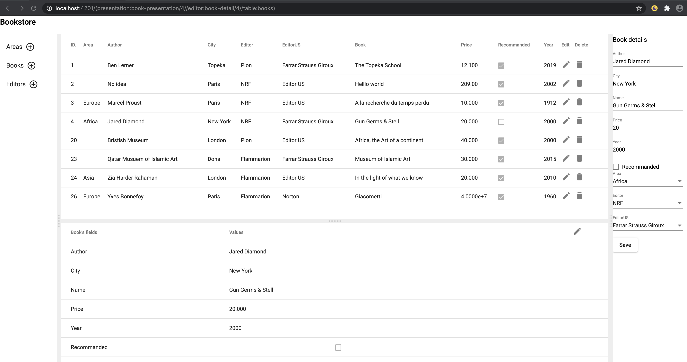

- [Gong](#gong)
  - [About Gong](#about-gong)
  - [Prerequisite](#prerequisite)
    - [Go](#go)
    - [go-swagger (generating Postman files)](#go-swagger-generating-postman-files)
    - [Angular](#angular)
    - [Vscode](#vscode)
  - [Description of a gong application](#description-of-a-gong-application)
- [Using gong](#using-gong)
  - [installing The gong compiler](#installing-the-gong-compiler)
  - [reusable stacks](#reusable-stacks)
  - [example](#example)
  - [Other ressources](#other-ressources)

# Gong


*Example of a generated application with gong*

## About Gong

Gong is about making fullstack development more *fun* and less *boring*.

What is *fun* and *boring* in full stack development ?
- *Fun* stuff:
  - business logic and gui design.
- *Boring* stuff:
  - database structure/access
  - API controllers
  - standard Angular Material Components
  - documentation with UML diagrams
- *Very boring* stuff:
  - maintaining *boring* stuff

Gong is a set of 2 compilers:

- `gongc`, a compiler that compiles the business logic written in `go`, extracts some elements in a `gong` language and generates the *boring* stuff in `go` and `ng`.

- `gongdoc`, a compiler that generates the UML documentation, a web site to view UML diagrams from `gong` code (the subset of `go` that is understood b `gongc`). `gongdoc`  is similar to `godoc` in its functionning ad also generates `svg` files from the diagram definition.

Gong stands for "`go` + `ng`". At its root, every gong stack has a `go` directory for the go backend code and `ng` directory for the angular frontend code.

## Prerequisite

### Go

go version equal or above 1.16 is mandatory (cf. use of `embed` package). See https://golang.org for installation.

### go-swagger (generating Postman files)

swagger is a go program is used after each `gongc` compilation to generate the project API in a `yml` file. 

It is not mandatory to install it.

On mac/linux, One way is

```bash
dir=$(mktemp -d) 
git clone https://github.com/go-swagger/go-swagger "$dir" 
cd "$dir"
go install ./cmd/swagger
```

on windows with powershell, creates and go into `go-swagger`
```bash
git clone https://github.com/go-swagger/go-swagger
go install ./go-swagger/cmd/swagger
```

setting up the path for `swagger` on mac/linux
```sh
export PATH=$PATH:$(go env GOPATH)/bin:$HOME/go/bin
```

### Angular

The `ng` command is used by different gong programs. Gong uses ng version >= 11 (see https://angular.io for installation)

### Vscode

Vscode is usefull & handy because the tasks definitionq and debug configuration related to gong are provided in the repository.

(note: No makefile is provided).

## Description of a gong application

A go package (for instance `<path>/go/models` ) written following the `gong` langage constraints can be compiled by the `gongc` compiler into a stack of integrated components:
- a set of `go` packages for the backend
- an `angular` library for the front end. 

This stack can be packaged into a reusable `gong` library to be used in another full stack developpemnent (a *bookstore* example is provided in the repository).

- a `<path>/go/orm` package, leveraging gorm, the fantastic go ORM, for the persistance into GORM supported database (sqlite3 in memory, sqlite3 file, postgres, ...)
- a `<path>/go/controllers` package, leveraging the gin framework, an HTTP web framework written in Go (Golang)
- a `<path>/go/controllers/<path>.yaml` open api 2.0 interface definition (thks to go-swagger), it provides a RESTful interface for  developing and consuming an API of the gong package

- a `<path>/ng/projects/<path>` angular service library for accessing gong object with some an angular material library with commonly used material components: table, editor, presentation, splitter presentation, arborescence presentation

if a gong variable data is created on the backend, a constraint is to register all instances on a store.

# Using gong

## installing The gong compiler

> cd stacks/gong/go/gongc; go install

## reusable stacks

A UML editor for documenting a gong model
> stacks/gongdoc

A generic simulator stack generated by gong
> stacks/gongsim

## example

A gong stack using the gongsim & gongdoc stacks
> examples/laundromat 

## Other ressources

https://github.com/fullstack-lang/helloworld --> a simple gong stack

https://github.com/fullstack-lang/gongleaflet --> a reusable gong stack for using leaflet