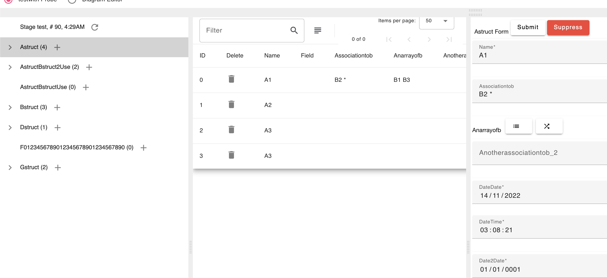

- [1. Gong](#1-gong)
  - [1.1. About Gong](#11-about-gong)
  - [1.2. Stack configuration management](#12-stack-configuration-management)
  - [1.3. Gong is intended for system engineering tooling](#13-gong-is-intended-for-system-engineering-tooling)
  - [1.4. Prerequisite](#14-prerequisite)
    - [1.4.1. Go](#141-go)
    - [1.4.2. gcc](#142-gcc)
    - [1.4.3. go-swagger (optional)](#143-go-swagger-optional)
    - [1.4.4. npm](#144-npm)
    - [1.4.5. Angular](#145-angular)
    - [1.4.6. Vscode (optional)](#146-vscode-optional)
  - [1.5. Developper Documentation](#15-developper-documentation)
    - [1.5.1. Gong API](#151-gong-api)
    - [1.5.2. Persistance as go code](#152-persistance-as-go-code)
    - [1.5.3. Implementattion Details](#153-implementattion-details)
- [2. Using gong](#2-using-gong)
  - [2.1. Running the gong test application](#21-running-the-gong-test-application)
  - [2.2. Testing the generation of the code](#22-testing-the-generation-of-the-code)
  - [2.3. Reusable stacks](#23-reusable-stacks)
  - [2.4. Examples](#24-examples)
  - [2.5. A "hello world" stack in 5 minutes](#25-a-hello-world-stack-in-5-minutes)
    - [2.5.1. Generating the code with the `gongc` command](#251-generating-the-code-with-the-gongc-command)
    - [2.5.2. Performance of the `gongc` command](#252-performance-of-the-gongc-command)
    - [2.5.3. Injecting Data via REST](#253-injecting-data-via-rest)

# 1. Gong


With gong, a web application is a set of stacks. Each stack, based on go and angular, has its own data model.

*Gong is a work in progress. API of the framework is not yet stabilized/baselined*

## 1.1. About Gong

Gong (go + ng) is a framework for rapid web application development (a.k.a. full stack development). It is based on two development langages: go for the back-end and angular for the front-end. Gong idea is to leverages best in class components. The back-end leverages [gin](https://github.com/gin-gonic/gin), a web framework and [gorm](https://gorm.io/index.html), an ORM. The front-end leverages [angular material](https://material.angular.io/), an library of angular components.

The unit of development in gong is the **gong stack** (a "stack" in the rest of this document). A stack can import other stacks (both the front end and the back end of a stack are integrated as a whole). The granularity of a stack is similar to an angular components. There are available stacks for [jointjs](https://www.jointjs.com/) and [leaflet](https://leafletjs.com/).

## 1.2. Stack configuration management

The configuration of *both* back-end and front-end code of a stack is a single configuration item.

This is done thank the go `module`. For the go code, it is the standard way of managing dependencies. For the angular/typescript/js code, it is done in four steps.

First, gong uses the go `embed` fearure that allows, by using four lines of go in a file stored in the angular workspace to directory,

```go
package ng
import "embed"
//go:embed projects
var Projects embed.FS
```

that the code in the angular workspace `projects` directory is stored into the `go module`.

The second step is to import the created `ng package` in the project that will use the stack. For instance, the following line makes avaible the `Project` directory to the project.

```go
	_ "github.com/fullstack-lang/gongjointjs/ng"
  ```

The third step is another go feature, the  `go mod vendor` command, that makes available the source code of all dependencies in a `vendor` directory simply by issuing the command. Then, the angular code is now in the directory `vendor/github.com/fullstack-lang/gongjointjs/ng`.

The four step is to define your front-end dependency by using the `tsconfig.json` file and point it the to import path into the `vendor` directory (instead of using the installation by `npm install` of the imported front code module). you are therefore assured that your back-end code and front-end code belong to the same configuration. (see the https://github.com/fullstack-lang/gongproject/blob/master/ng/tsconfig.json for an example of tsconfig.json configuration).

## 1.3. Gong is intended for system engineering tooling

Gong fullstack approach was inspired by [Ruby on Rails](https://rubyonrails.org/) and a more generaly the idea that complexity facing the programmer should be carefuly managed, as it is described in [conceptual compression concept](https://m.signalvnoise.com/conceptual-compression-means-beginners-dont-need-to-know-sql-hallelujah/) and [Rob Pike's design of Go regarding complexity](https://www.dotconferences.com/2015/11/rob-pike-simplicity-is-complicated).

Gong fullstack approach, with a backend in go, is similar in intent to [lorca](https://github.com/zserge/lorca), [wails](https://github.com/wailsapp/wails) and [fyne](https://github.com/fyne-io/fyne). However, the gong framework approach is different because it includes gongc, a go data model compiler to generate front-end and back-end code. In this sense, it is similar to [ent](https://github.com/ent/ent) which includes a ("shema as code") approach.

Also, gong's stated goal is narrower since it is the rapid development of web applications for system engineering (see [paper](https://www.researchgate.net/publication/354237095_GONG_an_open_source_MBSE_toolset/references#fullTextFileContent) for details on this goal)

## 1.4. Prerequisite

### 1.4.1. Go

go version equal or above 1.16 is mandatory (cf. use of `embed` package). See https://golang.org for installation.

### 1.4.2. gcc

A stack uses gorm for database access and sqlite as the default database. The sqlite driver requires cgo, which requires gcc.

### 1.4.3. go-swagger (optional)

[go-swagger](https://github.com/go-swagger/go-swagger) is a go program is used after each `gongc` compilation to generate the project API in a `yml` file. *gongc* is robust to the absence of go-swagger but it is recommanded to use it if you need to document the API with yaml.

### 1.4.4. npm

Gong uses npm version >= 6.14 (see https://nodejs.org)

### 1.4.5. Angular

Gong uses angular version >= 11 (see https://angular.io for installation)

### 1.4.6. Vscode (optional)

Vscode is usefull & handy because the tasks definitions and debug configuration related to gong are provided in the repository.

## 1.5. Developper Documentation

### 1.5.1. Gong API

See [gong back-end API](./docs/gong-go-api.md) for API details.

### 1.5.2. Persistance as go code

Gong's goal is to speed up development of full stack applications. Gong's goal is therefore to allow fast iterations of the database model and **content/database**.

An iteration of the data model can include an addition or removal of a concept (a go´struct') or the addition or removal of a field of a concept. In this case, the 'gorm' tool takes care of the content/database migration.

An iteration can also include a renaming of a field or the renaming of a struct. In this case, the code can be automatically changed by the use of the refactoring function of the ["go please" langage server](https://github.com/golang/tools/tree/master/gopls) for the backend and the [typescript language server](https://github.com/typescript-language-server/typescript-language-server) for the front end.

Wihout gong, if one needs to refactor the name of a gongstruct or the name of a field of a gongstruct, the content/database of the application must be refactored by hand.

For instance :
 - via a json file
 - via the sqlite table/column renaming
 - via [gorm](https://gorm.io/docs/migration.html)

With gong, data refactoring is automatic. Gong API provides a `Marshall()` function of the staged objects that generates an `Unmarshall()` function in go code (a persistance of the repository data as go code)

when refactoring the code, the generated go code is refactored. Therefore, no need to manualy refactor the data.

### 1.5.3. Implementattion Details

See [gong back-end implementation](./docs/gong-go-impl.md) for implementation details.

# 2. Using gong

## 2.1. Running the gong test application

the `test` directory contains a stack wit the generated code.

```
cd test/ng
npm i; ng build
cd ..
go run main.go
```

Then, browse to [localhost:8080](http://localhost:8080)


*Example of a generated application with gong*

## 2.2. Testing the generation of the code

Installing The gong compiler.

From the root directory.

> cd go/gongc; go install; cd ../..

Generating the code

> cd test; gongc go/models

## 2.3. Reusable stacks

A gong application is a stack that can integrate other stacks. Below is a list of stacks that can be reused. 

https://github.com/fullstack-lang/gongdoc, a UML editor (based on jointjs) for documenting a gong model. gongdoc uses the gong stack.

https://github.com/fullstack-lang/gongsim, a stack for developping simulations

https://github.com/fullstack-lang/gongleaflet, a stack for developping application with leaflet carto components

https://github.com/fullstack-lang/gongsvg, a stack for developping application with svg graphical components

https://github.com/fullstack-lang/gongjointjs, a stack for developping application with jointjs interactive graphical component

## 2.4. Examples

https://github.com/fullstack-lang/helloworld is a recommanded starting point for understanding gong.

https://github.com/fullstack-lang/bookstore is a little more sophisticated example than helloworld.

https://github.com/fullstack-lang/laundromat, is a more sophisticated example. It is a simulation stack that reuses 3 other stacks (gong, gongsim, gongdoc)

https://github.com/fullstack-lang/gongfly, an airplane simulation that reuses 4 stacks (gong, gongsim, gongdoc, gongleaflet)

https://github.com/fullstack-lang/gongproject, a project management application that reuses 3 stacks (gong, gongjointjs, gongdoc)


## 2.5. A "hello world" stack in 5 minutes

If prerequisite and gongc are installed, 
it is possible to generate a functionning stack in 5 minutes. 

### 2.5.1. Generating the code with the `gongc` command

In a terminal, below commands :

- `mkdir` creates a `helloworld` directory
- `mkdir` generates a sub directory `go/models`
- `echo` commands generates 2 go structs in this subdirectory
  - `Hello` which stores a way to say hello
  - `Country` which stores a country and an association to the way to say hello in this country 
- `gongc go/models` compiles the models
- `./helloworld` run the server

```bash
mkdir helloworld
cd helloworld
mkdir go
mkdir go/models
echo "package models
type Hello struct {
Name string
}" > go/models/hello.go
echo "package models
type Country struct {
Name string
Hello *Hello
}" > go/models/country.go
gongc go/models
cd go/cmd/helloworld
./helloworld --unmarshall=stage -marshallOnCommit=stage 
```

Then, browse to [localhost:8080](http://localhost:8080) and add data manualy.

With the option `-marshallOnCommit=stage`, a `stage.go` file is generated as each save operation (along the default sqlite database `test.db`). When the application is restarted with the `--unmarshall=stage` , the data is injected from the `stage.go` file, not from the database.

### 2.5.2. Performance of the `gongc` command

`gongc go/models` takes a few minutes the first time it is executed. `gongc` can be long the first time it is executed for a stack because it perfoms `npm i` which can be long if it is the first time (3'37'' on a macbook pro with a 2,6 GHz 6-Core Intel Core i7). 

If `gongc` is performed again, it will take a few tens seconds (32'' on a macbook pro with a 2,6 GHz 6-Core Intel Core i7).

### 2.5.3. Injecting Data via REST

The backend of a gong application is a REST server (thanks to gin). You can interact with the server via REST calls.

For instance, if you start from an empty database, the following commands will inject proprer data.

```
curl --request POST \
  --url http://localhost:8080/api/helloworld/go/v1/hellos \
  --header 'content-type: application/json' \
  --data '{"Name": "Bonjour"}'

curl --request POST \
  --url http://localhost:8080/api/helloworld/go/v1/hellos \
  --header 'content-type: application/json' \
  --data '{"Name": "Bonjorno"}'

curl --request POST \
  --url http://localhost:8080/api/helloworld/go/v1/countrys \
  --header 'content-type: application/json' \
  --data '{"Name": "France","HelloID":{"Int64":1,"Valid":true}}'

curl --request POST \
  --url http://localhost:8080/api/helloworld/go/v1/countrys \
  --header 'content-type: application/json' \
  --data '{"Name": "Italy","HelloID":{"Int64":2,"Valid":true}}'
  ```