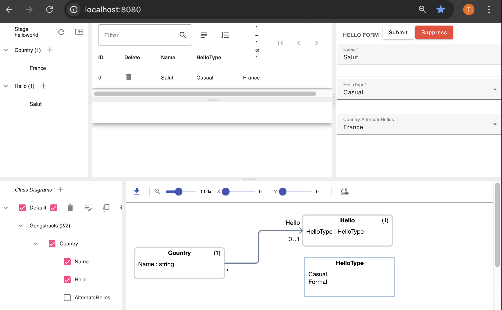

- [1. Why Gong ?](#1-why-gong-)
- [2. A "hello world" Domain Specific Modeling Environment (DSME) application](#2-a-hello-world-domain-specific-modeling-environment-dsm-application)
  - [2.1. Prerequisite](#21-prerequisite)
  - [2.2. Generating \& running the code with the `gong` command](#22-generating--running-the-code-with-the-gong-command)
- [3. Installing and compiling the gong repo](#3-installing-and-compiling-the-gong-repo)
- [4. Portable Applications](#4-portable-applications)
- [5. Status](#5-status)


# 1. Why Gong ?

Gong is a framework for lowering the effort for developping Domain Specific Modelling (DSM).

A DSM is an application that allows a users to edit data and diagrams.
The data is based on the abstract syntax of the Domain Specific Language (DSL). The diagrams are based on the concrete syntax of the DSL.

General Purpose Modeling Languages (GPML) like UML or SysML are standards with hundreds of elements in their abstract and concrete syntax. However, tailoring them to a specific domain often involves subsetting—ignoring the majority of the standard to focus on a narrow slice — and profiling (stereotypes) to bend generic concepts to specific needs.

Gong allows you to grow your DSM from a General Purpose Programming Language (GPPL), e.g. go. You start with an empty metamodel or an existing small metamodel close to your need and progressively introduce abstract and concrete syntax elements only as your understanding of the domain matures. 

Developing a robust DSM remains a complex task that requires familiarity with standard metamodeling patterns. Gong aims to democratize the development part of this process.

# 2. A "hello world" Domain Specific Modeling (DSM) application

## 2.1. Prerequisite

- go 1.25 (see https://go.dev/doc/install)

## 2.2. Generating & running the code with the `gong` command

In a terminal, execute the following commands:

```bash
go install github.com/fullstack-lang/gong/go/cmd/gong@main
mkdir helloworld
cd helloworld
mkdir go
mkdir go/models
echo "package models
type Hello struct {
  Name string
  HelloType HelloType
}" > go/models/hello.go
echo "package models
type Country struct {
  Name string
  Hello *Hello
  AlternateHellos []*Hello
}" > go/models/country.go
echo "package models
type HelloType string
const (
  Casual HelloType = \"Casual\"
  Formal HelloType = \"Formal\"
)" > go/models/hello_type.go
gong generate go/models
cd go/cmd/helloworld
./helloworld data/stage
cd ../../../..
rm -rf helloworld
```

Then, browse to [localhost:8080](http://localhost:8080) and add data manualy.



# 3. Installing and compiling the gong repo

```bash
git clone https://github.com/fullstack-lang/gong
cd gong/go/cmd/gong
go install
cd ../../..
./scripts/run_gong_conditionally.sh
```

# 4. Portable Applications

We provide portable, single-file HTML versions of some of our Domain Specific Modeling applications for each release.

To use them:
1. Click a link below to download the `.zip` file.
2. Unzip the downloaded file.
3. Double-click the extracted `.html` file to open the application in your web browser.

**Downloads (Latest Release):**
- [Process App](https://github.com/fullstack-lang/gong/releases/latest/download/process-app-portable.zip)
- [Statemachines App](https://github.com/fullstack-lang/gong/releases/latest/download/statemachines-app-portable.zip)
- [Barrgraph App](https://github.com/fullstack-lang/gong/releases/latest/download/barrgraph-app-portable.zip)
- [Project App](https://github.com/fullstack-lang/gong/releases/latest/download/project-app-portable.zip)

# 5. Status

Gong is a work in progress.