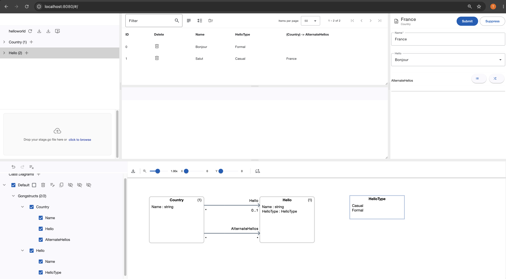

# 1. Domain-Specific Modeling (DSM) in the Browser

> [!NOTE]
> On average, the file to download is heavy (200 MB) and the zip is also heavy (74 MB).

## Systems Engineering

- **System hierarchy definition**: [Project](https://fullstack-lang.github.io/gong/project-app-portable.html) ([zip](https://fullstack-lang.github.io/gong/project-app-portable.zip)) supports the definition of Product Breakdown Structures (PBS), Work Breakdown Structures (WBS), task resource allocation, and execution planning.

- **Architecture viewpoints and stakeholder needs**: [Capture](https://fullstack-lang.github.io/gong/capture-app-portable.html) ([zip](https://fullstack-lang.github.io/gong/capture-app-portable.zip)) enables capturing stakeholder needs, operational concerns, high-level requirements, analysis concepts, and required architecture views in accordance with ISO 42010. A reference model of ISO 15288 process modeling requirements is provided as an example.

- **Stakeholder process modeling**: [Process](https://fullstack-lang.github.io/gong/process-app-portable.html) ([zip](https://fullstack-lang.github.io/gong/process-app-portable.zip)) facilitates the modeling of operational processes, participant swimlanes, tasks, data flows, and control flows, based on Business Process Model and Notation (BPMN) concepts.

- **System architecture and interface management**: [Structure](https://fullstack-lang.github.io/gong/structure-app-portable.html) ([zip](https://fullstack-lang.github.io/gong/structure-app-portable.zip)) provides modeling capabilities for system architectures, hierarchical component breakdowns, ports, and data/control flows (inspired by SysML Block Definition Diagrams).

- **State specification for software-intensive systems**: [Statemachines](https://fullstack-lang.github.io/gong/statemachines-app-portable.html) ([zip](https://fullstack-lang.github.io/gong/statemachines-app-portable.zip)) supports specifying discrete state machines, composite states, transitions, events, and actions (analogous to UML State Machine diagrams).

- **Requirements interchange format inspection**: [Reqif](https://fullstack-lang.github.io/gong/reqif-app-portable.html) ([zip](https://fullstack-lang.github.io/gong/reqif-app-portable.zip)) provides an inspection tool for files conforming to the Requirements Interchange Format (ReqIF).

## Prospective Analysis

- [Scenario](https://fullstack-lang.github.io/gong/scenario-app-portable.html) ([zip](https://fullstack-lang.github.io/gong/scenario-app-portable.zip)): exploration of operational scenarios, actor state evolutions, timeline trajectories, and parameter trade-offs.
- [Floss](https://fullstack-lang.github.io/gong/floss-app-portable.html) ([zip](https://fullstack-lang.github.io/gong/floss-app-portable.zip)): analysis of system complexity, performance, and effort trade-offs (based on de Weck's FLOSS equations).

## Stage Inspection and Diagnostics

Diagrams are rendered using Scalable Vector Graphics (SVG). Gong provides a Go-based representation (Go stage) for SVG rendering.

- [SVG](https://fullstack-lang.github.io/gong/svg-app-portable.html) ([zip](https://fullstack-lang.github.io/gong/svg-app-portable.zip)): inspection and analysis of SVG Go stages.

## Illustrative Demonstrations

- [Barrgraph](https://fullstack-lang.github.io/gong/barrgraph-app-portable.html) ([zip](https://fullstack-lang.github.io/gong/barrgraph-app-portable.zip)): visualization and editing of Alfred Barr's genealogical chart of modern art movements and artistic influences.
- [Phylla](https://fullstack-lang.github.io/gong/phylla-app-portable.html) ([zip](https://fullstack-lang.github.io/gong/phylla-app-portable.zip)): exploration of botanical phyllotaxis spiral patterns, 2D/3D plant geometries, and generative designs.

# 2. Rationale

Gong is a framework designed to minimize complexity for developping Domain-Specific Modeling (DSM) tool.

A DSM tool enables users to manage and visualize domain data through interactive diagrams. The underlying data model implements the abstract syntax of the DSM, while the diagrams represent the concrete visual syntax of the DSM.

A DSM can be developped using General Purpose Modeling Languages (GPML) such as UML or SysML, which are comprehensive standards encompassing hundreds of abstract and concrete syntax elements. However, tailoring (extending & checking the semantic) a model to a specialized domain typically necessitates extensive subsetting—restricting usage to a narrow portion of the standard—as well as profiling (stereotypes) to adapt generic concepts to domain-specific needs.

Gong enables the construction and evolution of a DSM directly from go, a General Purpose Programming Language (GPPL). Development can begin from a baseline domain model (such as Structure or Project), with abstract and concrete syntax elements introduced incrementally as domain requirements mature. Go and Gong reduces the complexity of the extensibility and semantic checkability of the model.

# 3. "Hello World" Web Application Example

## 3.1. Prerequisites

- Go 1.26 or later (refer to https://go.dev/doc/install)

## 3.2. Code Generation and Execution

Execute the following commands in a terminal:

```bash
go install github.com/fullstack-lang/gong/go/cmd/gong@main
mkdir helloworld
cd helloworld
mkdir go
mkdir go/models
echo "package models
type Hello struct {
  Name string
  HelloType HelloType
}" > go/models/hello.go
echo "package models
type Country struct {
  Name string
  Hello *Hello
  AlternateHellos []*Hello
}" > go/models/country.go
echo "package models
type HelloType string
const (
  Casual HelloType = \"Casual\"
  Formal HelloType = \"Formal\"
)" > go/models/hello_type.go
gong generate go/models
cd go/cmd/helloworld
./helloworld data/stage
cd ../../../..
rm -rf helloworld
```

Once running, navigate to [http://localhost:8080](http://localhost:8080) to inspect and edit the model instances:



# 4. Building from Source

```bash
git clone https://github.com/fullstack-lang/gong
cd gong/go/cmd/gong
go install
cd ../../..
./scripts/run_gong_conditionally.sh
```

# 5. Project Status

Gong is currently in active development.

# 6. License and Copyright

The source code in this repository is licensed under the MIT License. See the [LICENSE](LICENSE) file for details.

**Exceptions:**
* The data in `dsm/barrgraph/go/cmd/barrgraph/data/cubism and abstract art.go` and the diagrams it generates are copyrighted by MoMA & Alfred Barr's estate.
* The data in `dsm/phylla/go/cmd/phylla/data/stage.go` and the design objects it generates are copyrighted by Valerie Rostaing & Thomas Peugeot.

Please refer to the [NOTICE](NOTICE) file for more information.
