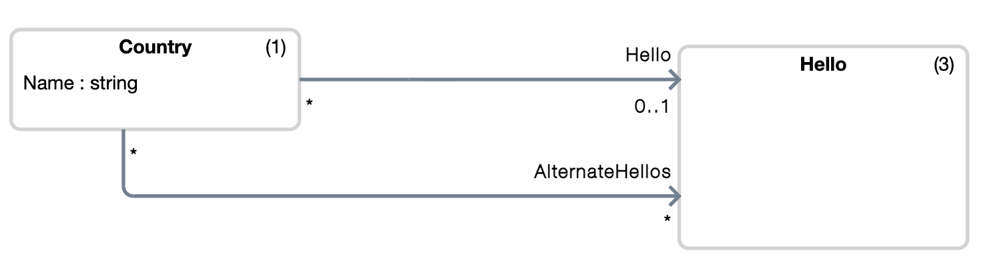

# Proposal: GoML (go-m-l) — Using Go as its Own Markup Language

add reference to de weck paper . related manybdesign 
decision follows explicitly from a desire
to minimize complexity :

- completly hide the non go code from usual
tool development 
- single binary with very small size (80 mo) for
the probe
- use if go modules to synchronize configuration 
between backend and frontend
- use of go as the markup language 
- allow for very fast refactoring (velocity is a consequence of 
simplicity because the mental model is not hindered 
by the refactoring task)


add code tgat generates code tgst generates code

add that the rigorous model verification. against which version 
of the rules is my data semantically correct

next steps:

- one package , not good for complex multi namespaces 
stuff 

- one file. not possible yet to import another 
data file. This requires working with directories instead of single file and having to declare the variables ouside the anonymous function.

- overcoming the API restriction.

The gong compiler generates code within the package and some name collision might happen with the existing code.
For instance 


```go
type Books struct {
	XMLNSXSI       string `xml:"xmlns:xsi,attr"`
	SchemaLocation string `xml:"xsi:noNamespaceSchemaLocation,attr"`

	XMLName xml.Name `xml:"books"`
	Books   []Book   `xml:"book"`
}
```


## Abstract
In the world of Go development, we often rely on external serialization formats like JSON or YAML to define data and configuration. While these are industry standards, they lack native integration with the Go toolchain, requiring developers to learn separate syntaxes and deal with "bracket hell" or indentation errors. 

This paper proposes **GoYAML**, a methodology and toolset where pure Go is used as the markup language itself. By leveraging the Go compiler and the Language Server Protocol (`gopls`), we can treat data files as first-class Go code. This approach enables native type-safety, seamless refactoring, and complex constraint validation without leaving the Go ecosystem.

add also xml as the alternative (need to learn xsd)
---

## 1. Introduction & Background
The project originated during the development of music generation software. While exploring data storage formats, I realized that existing markup languages were unnecessarily complex for certain modeling tasks. Instead of adopting a new Domain Specific Language (DSL), I developed a format based on **pure Go code** to act as a markup language.

### The Core Problem
* **Context Switching:** Moving between Go logic and YAML/JSON data.
* **Lack of Tooling:** Traditional markup doesn't natively support Go-specific refactoring or complex semantic checks.
* **Deep Nesting:** JSON often suffers from deep, unreadable hierarchies.

--- 
Consider the following model code of a package "helloworld/go/models"

```go
package models

type Hello struct {
	Name      string
	HelloType HelloType
}
type HelloType string

const (
	Casual HelloType = "Casual"
	Formal HelloType = "Formal"
)

type Country struct {
  Name string
  Hello *Hello
  AlternateHellos []*Hello
}
```

and now consider the following data code that instantiates 4 objects: one Country and 3 Hellos.

```go
package main

import (
	"helloworld/go/models"
)

func _(stage *models.Stage) {

	// insertion point for declaration of instances to stage

	__Country__00000000_ := (&models.Country{Name: `France`}).Stage(stage)

	__Hello__00000000_ := (&models.Hello{Name: `Bonjour`}).Stage(stage)
	__Hello__00000001_ := (&models.Hello{Name: `Salut`}).Stage(stage)
	__Hello__00000002_ := (&models.Hello{Name: `Bonjour Monsieur`}).Stage(stage)

	// insertion point for initialization of values

	__Country__00000000_.Name = `France`

	__Hello__00000000_.Name = `Bonjour`
	__Hello__00000000_.HelloType = models.Formal

	__Hello__00000001_.Name = `Salut`
	__Hello__00000001_.HelloType = models.Casual

	__Hello__00000002_.Name = `Bonjour, Monsieur/Madame`
	__Hello__00000002_.HelloType = models.Formal

	// insertion point for setup of pointers
	__Country__00000000_.Hello = __Hello__00000000_
	__Country__00000000_.AlternateHellos = append(__Country__00000000_.AlternateHellos, __Hello__00000001_)
	__Country__00000000_.AlternateHellos = append(__Country__00000000_.AlternateHellos, __Hello__00000002_)
}
```

The declaration of an instance is followed by a call to a `Stage(stage)` method. We will see later but this method generated by a command "gong generate" that 
you run in the package directory.

When you program with `git`, you "stage" your changes. With goyaml, this is the same, you `Stage` your objects and the diff are automaticaly computed. 
Think of the stage as the 

And now, consider the following

```go
	__Country__00000000_ := (&models.Country{Name: `France`}).Stage(stage)

	// insertion point for initialization of values

	__Country__00000000_.Name = `France`

	// insertion point for setup of pointers
	__Country__00000000_.Hello = nil

	stage.Commit()

	__Hello__00000000_ := (&models.Hello{Name: `Bonjour`}).Stage(stage)
	__Hello__00000000_.Name = `Bonjour`
	__Hello__00000000_.HelloType = ""
	stage.Commit()

	// France
	__Country__00000000_.Hello = __Hello__00000000_
	stage.Commit()

	__Hello__00000001_ := (&models.Hello{Name: `Bonjour Monsieur`}).Stage(stage)
	// France
	__Country__00000000_.AlternateHellos = slices.Insert( __Country__00000000_.AlternateHellos, 0, __Hello__00000001_)
	__Hello__00000001_.Name = `Bonjour Monsieur`
	__Hello__00000001_.HelloType = models.Formal
	stage.Commit()

	__Hello__00000002_ := (&models.Hello{Name: `Salut`}).Stage(stage)
	// France
	__Country__00000000_.AlternateHellos = slices.Insert( __Country__00000000_.AlternateHellos, 1, __Hello__00000002_)
	__Hello__00000002_.Name = `Salut`
	__Hello__00000002_.HelloType = models.Casual
	stage.Commit()
```

In this case, the goyaml file have historisation. As in git, each modification of the stage is traced with a `stage.Commit()` command.

And now consider the following diagram, a UML like representation of model code with the number of instance per go struct.



---

## 2. Technical Architecture
GoYAML splits the data definition into two distinct parts:

* **Model Code:** Defines the structures, types, and constraints.
* **Data Code:** Effectively functions as the "markup" file. 

### Implementation Strategies
1.  **Anonymous Functions:** Data can be defined in anonymous functions. By renaming these to public functions, you can manually initiate data within your code.
2.  **Generated Packages:** The compiler can generate an internal package providing a specialized **API** to initiate data and document the model.

---

## 3. Key Features & Advantages

### A. Zero Learning Curve
If you already program in Go, you don't need to learn a new syntax. The data is Go; the logic is Go.

### B. Native IDE & LSP Support
Because the data files are `.go` files:
* **gopls** naturally checks for syntax and semantic errors.
* **Refactoring:** Renaming a field in your model automatically updates all 1,000+ data files using standard IDE tools.

### C. Versioning & History Mode
GoYAML supports an optional **History Model**. Instead of just storing the final state, the file can contain the creation steps and value assignments (similar to a Git commit history) within the data file itself.

### D. Solving "Bracket Hell"
Unlike JSON, GoYAML encourages a flat structure:
* Every object has a unique identifier (variable name).
* Relationships are established via **pointer assignments** or **slices of pointers**, ensuring the nesting depth do not exceeds one level.
* Recursive pointer chains and duplicate pointers to the same object are not a duplicate problem.

For instance,
```json
[
  {
    "Name": "France",
    "Hello": {
      "Name": "Bonjour",
      "HelloType": "Formal"
    },
    "AlternateHellos": [...]
  },
  {
    "Name": "Belgium",
    "Hello": {
      "Name": "Bonjour",
      "HelloType": "Formal"
    },
    "AlternateHellos": null
  }
]
```

### E. Ready to use probe to edit the data, navigate history and view the model

* Explore the data and modify it
* Navigate history of the data code
* Edit and consult UML views of the model
* UML views are robust to renamings of objects

### F. Ready to use go API for marshalling/unmarshalling goyam files

* `MarshallFile` and `UnmarshallFile` methods
* Available mode to marshall only last commits or to revert last commits


---

## 4. Modeling Levels (M0 - M3)
For those interested in formal modeling, GoYAML utilizes Go across all four layers of the modeling stack:
* **M3 (Meta-Meta-Model):** The Go language specification itself.
* **M2 (Meta-Model):** A subset of Go used to express the model code.
* **M1 (Model):** The specific domain model defined by the user.
* **M0 (Data):** The actual instances/objects defined in the data files.

---

## 5. Tooling & Performance
The GoYAML compiler generates:
* **Marshaling API:** Provides a stage-based approach to instantiating data.
* **The Probe Program:** A generated utility for basic data navigation and editing tasks.
* **Visual Documentation:** Automatic diagram generation for the model.

**Benchmarks:**
The system has been tested with models containing **100 distinct concepts** and datasets exceeding **50,000 objects** with high stability.

---

## 6. Conclusion
By using Go as a markup language, we bridge the gap between data and logic. We gain the full power of the Go compiler for our data, including type safety, performance, and world-class refactoring tools.

---

**Next Step:** Would you like me to help you expand on the "M0-M3" modeling section to make it more academic, or should I focus on drafting a "Takeaways" section for the GopherCon reviewers?