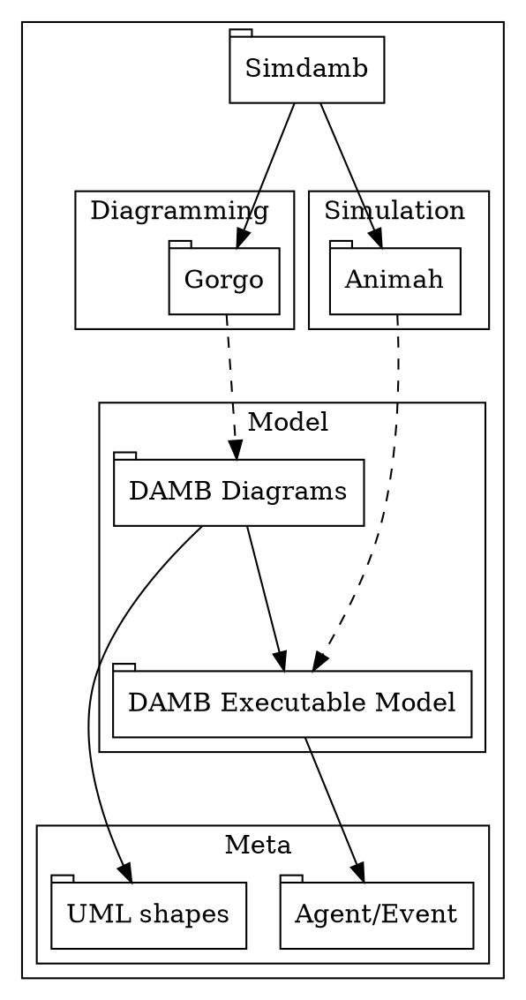

Il faut installer "raphviz Markdown Preview" pour voir les dépendances
https://graphviz.org/doc/info/lang.html

```graphviz
digraph diagram {
    compound=true;
    ranksep=1.1
    node[shape=record]

    subgraph cluster_all {

        subgraph cluster_diagramming {
            label="Diagramming "
            "Gorgo" [shape=tab]
        }

        subgraph cluster_simulation {
            label="Simulation "
            "Animah" [shape=tab]
        }

        Simdamb [shape=tab]

        
        Simdamb -> "Animah" [lhead=cluster_presentation]
        Simdamb -> "Gorgo" [lhead=cluster_presentation]

        subgraph cluster_models {
            label="Model "
            node[shape=tab]
            "DAMB Executable Model"
            "DAMB Diagrams"
        }

        subgraph cluster_generic {
            label="Meta "
            "Agent/Event" [shape=tab]
            "UML shapes" [shape=tab]
        }

        "DAMB Diagrams" -> "UML shapes" [lhead=cluster_business,ltail=cluster_presentation]

        "DAMB Diagrams" -> "DAMB Executable Model" 

        "DAMB Executable Model" -> "Agent/Event" [lhead=cluster_business,ltail=cluster_presentation]

        "Gorgo" -> "DAMB Diagrams" [lhead=cluster_business,ltail=cluster_presentation,style=dashed]

        "Animah" -> "DAMB Executable Model" [lhead=cluster_business,ltail=cluster_presentation,style=dashed]
    }

}

```
